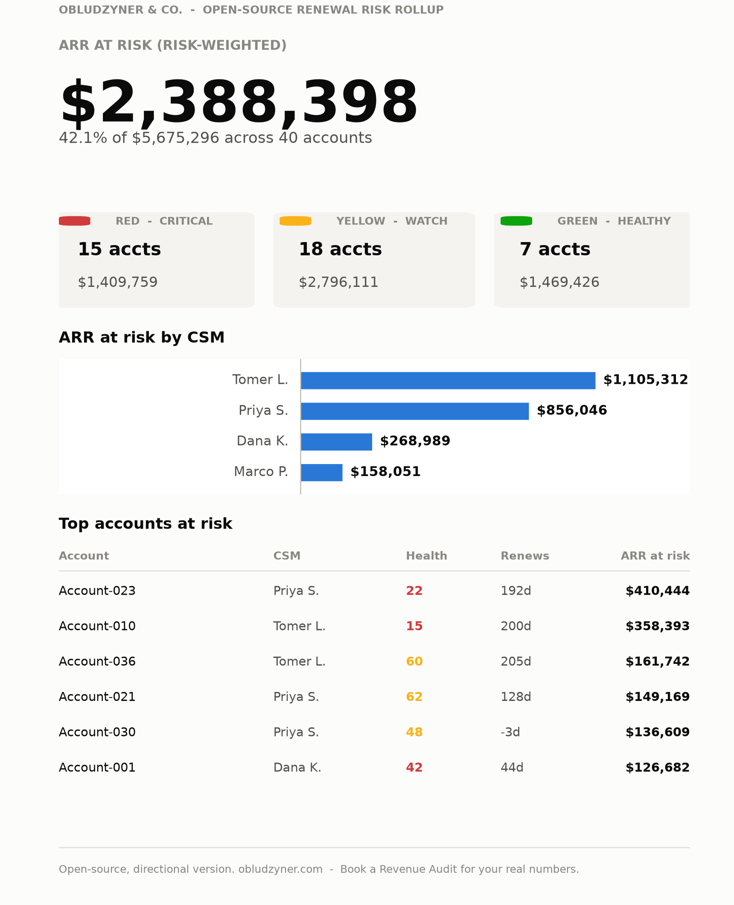

# Renewal Risk & ARR-at-Risk Rollup (open-source edition)

A zero-dependency tool that turns a flat CSV of accounts into a leadership-ready view of revenue at risk, broken out by CSM, segment, and renewal window.

This is the account-level companion to [nrr-leak-diagnostic](https://github.com/marianoobludzyner-hub/nrr-leak-diagnostic). That tool estimates leak at the company level from 7 questions. This one rolls the same question up from your actual portfolio: which accounts, whose book, which renewal window.

<p align="center">
  
</p>

<p align="center"><sub>Real output from a 40-account synthetic portfolio - not a mockup. Full data: <a href="examples/sample_result.json">sample_result.json</a>.</sub></p>

## What you get

- **A headline number** - total ARR at risk, risk-weighted, as a percentage of the portfolio
- **Health-band cards** - account count and ARR in Red / Yellow / Green at a glance
- **ARR at risk by CSM** - the cut that usually matters most to a leader: whose book carries the risk
- **A top-accounts table** - the specific accounts to act on today, not just a percentage

## Why this project

"We think we have some at-risk accounts" is not a plan. "$1.5M of our Enterprise segment is at risk, concentrated in Tomer's book, and $340K of it renews in the next 30 days" is a plan. This tool exists to turn a CSV export from your CRM/CS platform into the second sentence, in one command, with the method fully visible.

## How to run it

The rollup logic (`rollup.py`) is pure Python standard library, zero installs:

```bash
# Don't have a real export handy? Generate a synthetic one to try it on:
python3 rollup.py --generate-sample my_accounts.csv --sample-size 40

# Run the rollup
python3 rollup.py --csv my_accounts.csv

# Or get JSON + a lightweight, dependency-free chart
python3 rollup.py --csv my_accounts.csv --json --svg rollup.svg
```

CSV columns required (header row, any order): `account_name, csm, segment, arr, health_score, days_to_renewal`

For the full dashboard shown above (health-band cards, the CSM chart, the top-accounts table), pipe the JSON into `render_chart.py`, which uses matplotlib:

```bash
pip install matplotlib
python3 rollup.py --csv my_accounts.csv --json > result.json
python3 render_chart.py result.json dashboard.png
```

The rollup logic you'd audit or hand to an agent has zero dependencies; the presentation layer opts into matplotlib because that is what it takes to render something worth sharing.

Example output on a 40-account synthetic portfolio: [`examples/sample_dashboard.png`](examples/sample_dashboard.png) (the full dashboard), [`examples/sample_result.svg`](examples/sample_result.svg) (the zero-dependency chart), [`examples/sample_result.json`](examples/sample_result.json) (the raw data), built from [`examples/sample_accounts.csv`](examples/sample_accounts.csv).

## Run it as a Claude Skill

See [`skill/SKILL.md`](skill/SKILL.md). Point Claude at your CRM export (or ask it to pull the columns from wherever your account data lives) and it will run the rollup and walk you through the result.

## Run it as your own GPT

See [`gpt/CUSTOM_GPT_INSTRUCTIONS.md`](gpt/CUSTOM_GPT_INSTRUCTIONS.md) -- paste it into a Custom GPT's instructions field (Code Interpreter enabled) and upload your CSV directly in the chat.

## Method and sources

- Health bands: Red < 45, Yellow 45-69, Green >= 70. These are directional, not your scorecard -- change `RED_MAX` / `YELLOW_MAX` in `rollup.py` to match your own definitions.
- Risk weights: Red counts 100% of ARR as at risk, Yellow 35%, Green 0%. Change `RISK_WEIGHTS` in `rollup.py` if your own churn-by-band history says otherwise -- this is the single most important number to calibrate against your real data.
- This is intentionally simple: one health score per account, one weight per band. A real Revenue Audit builds the health score itself from your actual usage, support, and billing signals, and calibrates the weights against your own historical churn, the way [nrr-leak-diagnostic](https://github.com/marianoobludzyner-hub/nrr-leak-diagnostic)'s baseline (5% churn / 20% expansion) was calibrated for B2B SaaS up to $10M ARR.

## Where this fits in SHIFT

This is also "S", one altitude deeper: the [SHIFT Method](https://obludzyner.com/#how)'s Revenue Audit works at the account level, not just the company level. Proof: at **Clicktale**, the audit surfaced that 60% of revenue up for renewal that quarter was concentrated in specific accounts and specific patterns, not evenly spread. 7 months later: 95% GRR, 115% NRR across a $10M portfolio -- the same shape of finding this rollup is built to surface.

## What this is not

This tells you where to look. It does not tell you why an account is Red, or what to do about it -- that is the Human alignment and Install steps of the SHIFT Method, not a spreadsheet. If the CSM breakdown above surprises you, that is the signal, not the noise.

---

**Obludzyner & Co.** -- Post-sales advisory for B2B SaaS. We install a commercial operating system that protects ARR and generates expansion in 90 days, without replacing your team or making you the bottleneck. [obludzyner.com](https://obludzyner.com) | [Start the diagnostic](https://obludzyner.com/diagnostic) | [Book a conversation](https://obludzyner.com/#contact)
